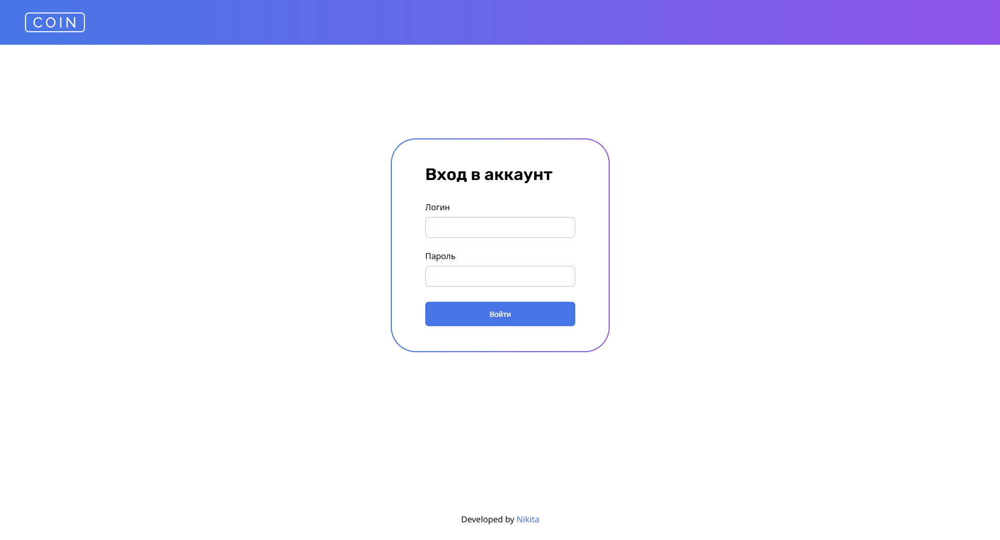
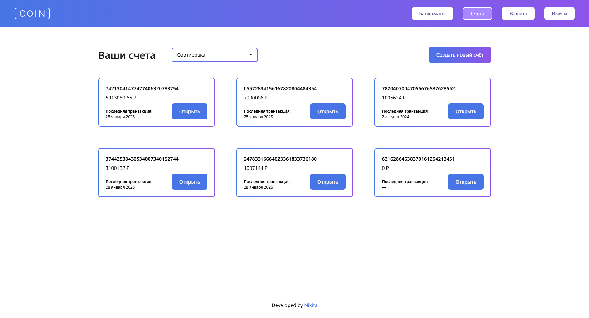
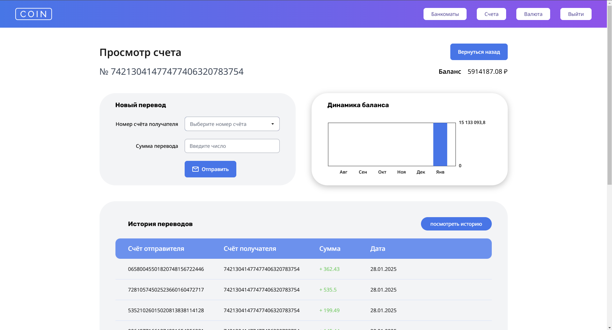
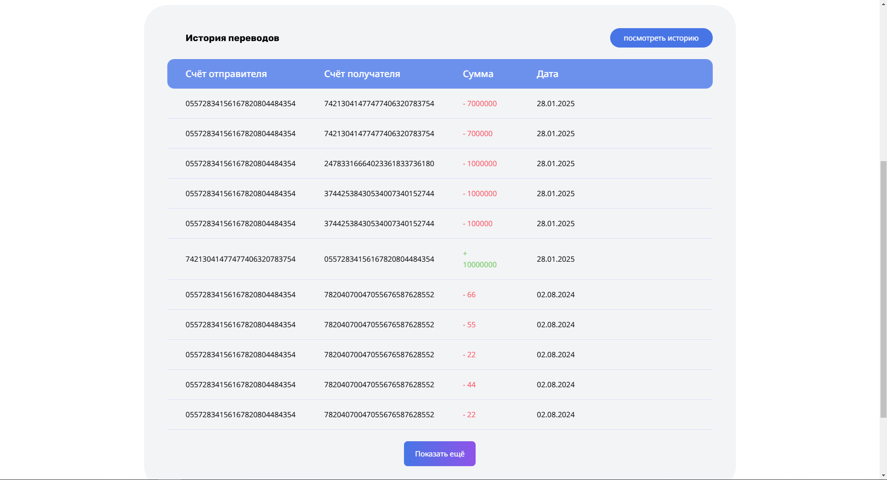
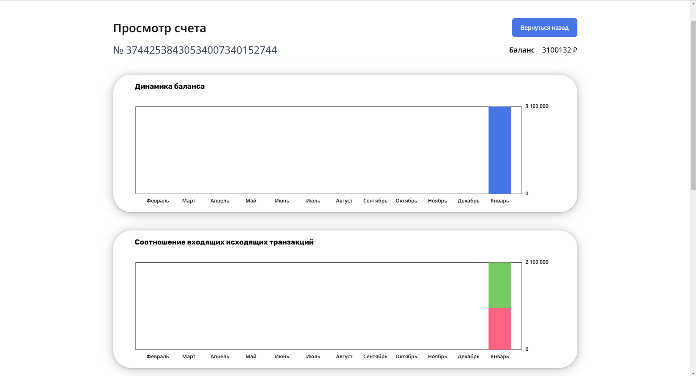
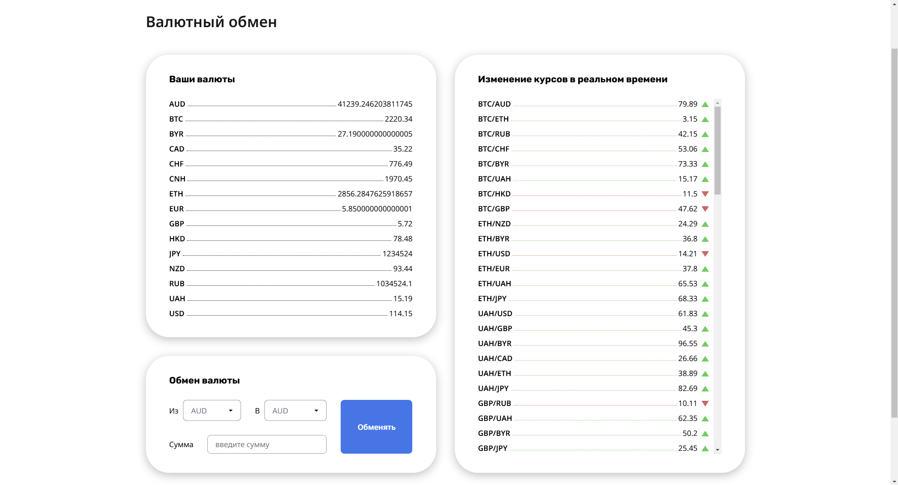

# coin-js

SPA-приложение на Javascript для банковской системы хранения валют

## Описание

Разработка банковской системы для хранения и управления криптовалютными средствами. Backend-сервер находится в папке **Backend**

В проекте реализованы:

- Авторизация
- Взаимодействия со счетами пользователя
- Сортировка счетов
- Отрисовка графиков
- Обновление курсов валют с помощью вебсокета
- Обмен валют
- Многое другое, о чем я допишу позже

**Internet Explorer не поддерживается**

## Используемые технологии

- JavaScript
- SASS, POSTCSS
- GULP + webpack

## Основные используемые библиотеки

- Navigo.js -- для роутинга на чистом JS
- Redom -- для упрощения создания элементов
- Chart.js -- для создания динамических графиков

### Страница с валидируемой авторизацией. Логин **developer**, пароль **coin**

### Основная страница со всеми счетами пользователя. Доступна сортировка счетов по номеру, балансу или последней транзакции. Кнопка "Создать новый счёт" создает новый счёт с уникальным номером и настоящей датой

### Страница с просмотром конкретного счёта. Ниже можно перейти в подробную историю с расширенными графиками и посмотреть последние транзакции

### Страница с историей транзакций пользователя

### Страница валютного обмена. Курсы валют меняются в реальном времени на сервере, они либо добавляются (и сразу же сортируются для удобства), либо обновляются. Слева изображены валюты, которые имеет пользователь. Снизу есть возможность обменять валюты

## Запуск проекта

- Установить зависимости командой npm i
- Запустить Бэкенд-сервер
  - Через cmd зайти в папку Backend и ввести комнаду npm start
- Запустить дев-мод командой gulp
- Логин **developer**, Пароль **coin**

**Сборка запускается на порте 3001, а сервер на 3000**

## Telegram

[Telegram](https://t.me/elsenimic)
